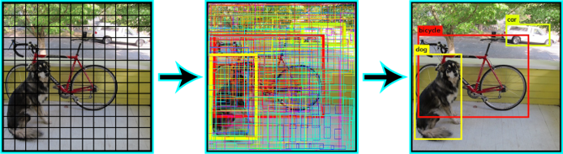
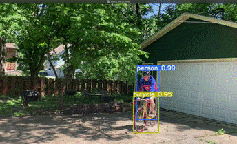
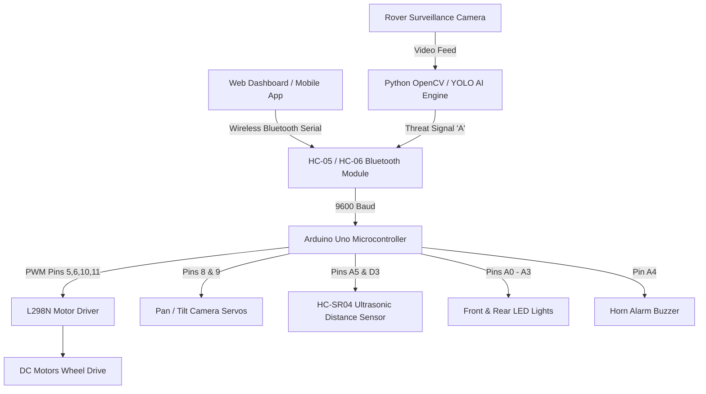

# 🤖 AI-Powered Security Rover & Weapon Detection System

[](https://www.arduino.cc/)
[](https://www.arduino.cc/)
[](https://www.python.org/)
[](https://opencv.org)
[](#)
[](#)

A comprehensive robotics and computer vision project integrating an **Arduino-controlled remote surveillance rover** with **Deep Learning & Artificial Intelligence for real-time weapon and threat detection**. Designed for automated surveillance, security applications, and perimeter defense.

---

## 📌 Table of Contents

- [Overview](#-overview)
- [🖼️ Hardware & System Showcase](#️-hardware--system-showcase)
- [✨ Advanced Features](#-advanced-features)
- [System Architecture](#-system-architecture)
- [Hardware Wiring & Pinout](#-hardware-wiring--pinout)
- [Bluetooth Communication Protocol](#-bluetooth-communication-protocol)
- [Python AI Weapon Detection Script](#-python-ai-weapon-detection-script)
- [Web Control Dashboard](#-web-control-dashboard)
- [Repository Structure](#-repository-structure)
- [Getting Started](#-getting-started)
- [Research & Project Reviews](#-research--project-reviews)
- [License](#-license)

---

## 🔍 Overview

Security monitoring in high-risk environments requires rapid threat identification and automated physical response. This project presents a dual-layer security solution:

1. **Physical Rover Hardware Chassis**: Controlled via an **Arduino Uno** and **L298N Motor Driver**, communicating wirelessly over a **Bluetooth HC-05/06 serial link**. Features variable PWM speed control, active electronic braking, directional steering, front/rear LED signaling lights, an acoustic buzzer horn, camera pan/tilt servos, and HC-SR04 ultrasonic obstacle avoidance.
2. **AI & Deep Learning Perception Pipeline**: Python computer vision pipeline trained for real-time weapon detection (firearms, knives, threat objects). Automatically triggers active rover alarms and emergency braking upon threat detection.

---

## 🖼️ Hardware & System Showcase

### 🛠️ Annotated Physical Hardware Assembly
Below is the physical hardware setup of the security rover with annotated component placements including the Arduino Board, L298N Motor Driver, HC-05 Bluetooth Module, LED Lights, 3D Printed Wheels, and Acrylic Chassis.


### 🎯 AI & Deep Learning Object Detection Pipeline
The computer vision pipeline utilizes grid-based bounding box predictions and deep neural network object classification (YOLO / MobileNet SSD) to identify target threats in real time.



### 🎬 System Operation & Demonstration
Demonstration preview of the teleoperated rover and autonomous threat response system in action.



---

## ✨ Advanced Features

- 🏎️ **Dynamic Motor Control**: Full 8-directional mobility (Forward, Reverse, Left, Right, Forward-Left, Forward-Right, Back-Left, Back-Right).
- 📷 **Camera Pan/Tilt Servo Control**: Dual-axis camera mount powered by 2x Servo motors (`Pin 8` & `Pin 9`) allowing 180° horizontal pan and vertical tilt scanning via Bluetooth or Web Dashboard.
- 🛡️ **HC-SR04 Ultrasonic Obstacle Avoidance**: Automatic safety distance measurement (`Pin A5 / D3`). Automatically halts rover motion if an obstacle is detected closer than 20cm.
- ⚡ **PWM Speed Adjustment**: 10 selectable speed levels (0–255 PWM range) dynamically updated over Bluetooth.
- 🚨 **Emergency Hazard Strobe Mode**: Alternating front and back LED strobe pattern for emergency signaling.
- 🎯 **Automated AI Threat Alarm**: Python OpenCV AI model transmits signal `'A'` on weapon detection to trigger high-intensity horn alarm and emergency braking.
- 💻 **Interactive Web Control Dashboard**: Modern web interface (`Code/dashboard/index.html`) featuring virtual joystick controls, speed sliders, lighting toggles, and live video stream window.

---

## 🏗️ System Architecture



---

## 🔌 Hardware Wiring & Pinout

| Component | Sub-function / Channel | Arduino Pin | Description / Type |
| :--- | :--- | :--- | :--- |
| **L298N Motor Driver** | IN1 (Motor A Forward) | `Pin 5` | PWM Output |
| **L298N Motor Driver** | IN2 (Motor A Reverse) | `Pin 6` | PWM Output |
| **L298N Motor Driver** | IN3 (Motor B Forward) | `Pin 10` | PWM Output |
| **L298N Motor Driver** | IN4 (Motor B Reverse) | `Pin 11` | PWM Output |
| **Camera Pan Servo** | Horizontal Axis | `Pin 8` | Servo PWM Output |
| **Camera Tilt Servo** | Vertical Axis | `Pin 9` | Servo PWM Output |
| **Ultrasonic Sensor** | Trig Pin | `Pin 19 (A5)` | Digital Output |
| **Ultrasonic Sensor** | Echo Pin | `Pin 3` | Digital Input (Interrupt) |
| **Front Headlights** | Front Right / Left LEDs | `Pin 14 (A0), Pin 15 (A1)` | Digital Output |
| **Rear Taillights** | Back Right / Left LEDs | `Pin 16 (A2), Pin 17 (A3)` | Digital Output |
| **Horn Alarm** | Acoustic Buzzer | `Pin 18 (A4)` | Digital Output |
| **HC-05/06 Bluetooth** | RX / TX | `Hardware Serial (0 / 1)` | 9600 Baud |

---

## 📡 Bluetooth Communication Protocol

### Directional & Steering Commands

| Command | Action | Command | Action |
| :---: | :--- | :---: | :--- |
| `F` | **Forward** | `G` | **Forward Left** |
| `B` | **Reverse** | `I` | **Forward Right** |
| `L` | **Turn Left** | `H` | **Back Left** |
| `R` | **Turn Right** | `J` | **Back Right** |
| `S` | **Electronic Stop / Brake** | | |

### Camera Pan/Tilt & Advanced Features

| Command | Action / Feature | Command | Action / Feature |
| :---: | :--- | :---: | :--- |
| `K` | Camera Pan Left | `N` | Camera Tilt Up |
| `M` | Camera Pan Right | `O` | Camera Tilt Down |
| `P` | Center Camera Position | `X` / `x` | Emergency Strobe Mode (ON / OFF) |
| `Y` / `y` | Obstacle Safety Avoidance (ON / OFF) | `A` / `a` | **AI Threat Alarm Trigger (ON / OFF)** |

---

## 🐍 Python AI Weapon Detection Script

Located in `Code/weapon_detection.py`, this script connects to the camera feed and serial port:

```bash
# Install dependencies
pip install opencv-python numpy pyserial ultralytics

# Run detection script (Replace COM3 with your Bluetooth port)
python Code/weapon_detection.py --port COM3 --camera 0
```

---

## 🌐 Web Control Dashboard

An interactive dashboard (`Code/dashboard/index.html`) is provided for controlling the rover from any browser.

Features:
- Touch & Mouse Virtual Joystick
- Dual-axis Camera Pan/Tilt Control Buttons
- Real-Time Speed Slider (100–255 PWM)
- Peripheral Toggle Buttons (Headlights, Taillights, Hazard Strobe, Obstacle Avoidance)
- Red Emergency Threat Alarm Button

---

## 📂 Repository Structure

```text
Rover_Project-main/
├── Screenshot 2026-07-20 084110.png  # Annotated Physical Rover Hardware Assembly
├── Picture2.png                      # YOLO Object Detection Pipeline Architecture
├── Picture1.gif                      # Animated Security Rover Demonstration
├── Code/
│   ├── newcAR.ino                    # Enhanced C++ Arduino firmware
│   ├── bt drone code.text            # Firmware code backup & reference
│   ├── weapon_detection.py           # Python OpenCV AI weapon detection script
│   └── dashboard/
│       └── index.html                # Web Control & Surveillance Dashboard
├── PAPERS/
│   ├── report.pdf                    # Comprehensive project report (PDF)
│   ├── report.docx                   # Project report document (Word)
│   ├── schematic.pdf                 # Hardware circuit wiring & schematic diagram
│   └── base papper...pdf             # Base Research Paper on ML Object Detection
├── REVIEW/
│   ├── 0TH/                          # 0th Review Presentation Decks
│   ├── 1ST/                          # 1st Review Presentation Decks
│   └── 2ND/                          # 2nd Final Review Presentation Decks
└── README.md                         # Updated Project Documentation
```

---

## 📜 License

This project is open-source and available under the [MIT License](LICENSE).
